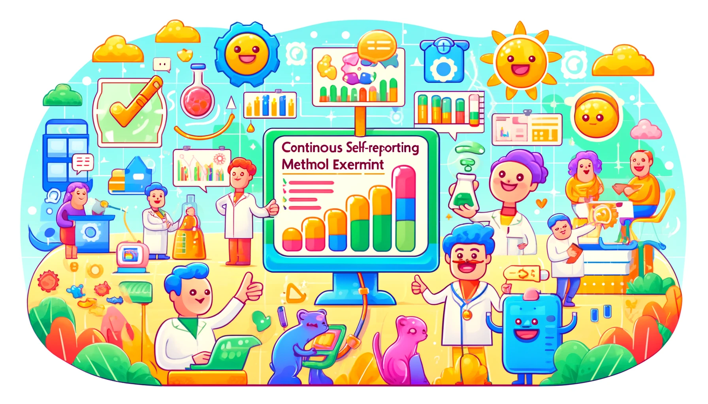

<div style="display: flex; justify-content: center;">
    
</div>

# CRM Experiment

This project implements a Continuous Self-Reporting Method (CRM) experiment to collect two-dimensional emotional data (
2DES) from participants (Schubert, 2010). The project is divided into three services: a WebSocket server, a Next.js
frontend, and a Flask backend. It allows synchronized data collection from multiple participants through WebSockets.

## Architecture

The project consists of three main components:

- WebSocket Server: Manages real-time communication between the frontend and backend, sending start and stop signals to
  participants.
- Next.js Frontend: Provides the user interface for participants and the admin, displaying the experiment and results
  pages.
- Flask Backend: Processes and stores data, resampling and synchronizing collected data, and storing it in an SQLite
  database. Generates plots using Matplotlib for the results page.

## Workflow

Participant Interaction:

1. Participants open the webpage.
2. Admin initiates the experiment.
3. Audio stimulus plays only on the admin's computer.
4. WebSocket server sends start signal to participants.

Data Collection:

1. Participants' emotional data is recorded continuously.
2. Data is resampled and synchronized.
3. Data Storage and Analysis:

Data is stored in an SQLite database.
Results can be visualized later on the results page.

## Usage

To run the project, you need Docker and Docker Compose installed on your machine. Then, you can start the services with:

```bash
docker-compose up
```

This will start the WebSocket server, frontend, and backend. The frontend will be available at http://localhost:80. To
start the live recording of data, navigate to http://localhost:80/admin.

## License

This project is licensed under the MIT License - see the LICENSE file for details.